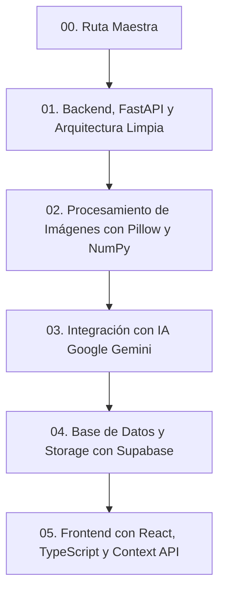

# 🗺️ Ruta Maestra de Aprendizaje: FactuSnap

Bienvenido a la **Ruta de Aprendizaje de FactuSnap**. Esta guía modular está diseñada para que domines todo el código y los conceptos esenciales utilizados en este proyecto, desde las bases hasta técnicas avanzadas de Inteligencia Artificial y procesamiento de imágenes.

---

## 🧭 ¿Cómo estudiar esta ruta?

Sigue los módulos en el orden sugerido. Cada documento contiene explicaciones conceptuales, analogías sencillas, fragmentos del código real de FactuSnap explicados **línea por línea**, y preguntas de autoevaluación.

---

## 📚 Módulos de Aprendizaje

| Módulo | Tema Principal | Archivo | ¿Qué aprenderás? |
| :--- | :--- | :--- | :--- |
| **01** | **Backend & FastAPI** | [`01_BACKEND_FASTAPI_Y_ARQUITECTURA.md`](file:///c:/Users/Yaorj/Documents/FactuSnap/docs/01_BACKEND_FASTAPI_Y_ARQUITECTURA.md) | FastAPI, Pydantic, Tipado estático en Python, Clean Architecture (Controller -> Service -> Repository), CORS y `uvicorn`. |
| **02** | **Matemáticas de Imágenes & PDF** | [`02_MATEMATICAS_DE_IMAGENES_NUMPY.md`](file:///c:/Users/Yaorj/Documents/FactuSnap/docs/02_MATEMATICAS_DE_IMAGENES_NUMPY.md) | Cómo ve una imagen la computadora (matrices), manipulación con Pillow/NumPy, cómo eliminamos el fondo con *Adaptive Thresholding (GaussianBlur)* y generación de PDFs. |
| **03** | **Inteligencia Artificial (Gemini)** | [`03_INTELIGENCIA_ARTIFICIAL_GEMINI.md`](file:///c:/Users/Yaorj/Documents/FactuSnap/docs/03_INTELIGENCIA_ARTIFICIAL_GEMINI.md) | Prompt Engineering estructurado, extracción estricta de JSON, optimización de imágenes pre-envío, manejo de límites de cuota (HTTP 429) y fallbacks defensivos. |
| **04** | **Base de Datos & Supabase** | [`04_PERSISTENCIA_SUPABASE.md`](file:///c:/Users/Yaorj/Documents/FactuSnap/docs/04_PERSISTENCIA_SUPABASE.md) | PostgreSQL en la nube, diferencia entre Storage (archivos PDF) y Database (tablas), sanitización de nombres de archivo y el patrón Repository. |
| **05** | **Frontend con React & TypeScript** | [`05_FRONTEND_REACT_TS.md`](file:///c:/Users/Yaorj/Documents/FactuSnap/docs/05_FRONTEND_REACT_TS.md) | Componentes funcionales, TypeScript Interfaces, subida de archivos binarios con `multipart/form-data`, y gestión de estado global con Context API. |

---

## 🎯 Habilidades que habrás adquirido al finalizar
1. Capacidad de estructurar cualquier backend profesional en Python siguiendo patrones limpios.
2. Comprensión de cómo manipular imágenes y matrices numéricas a bajo nivel.
3. Saber cómo pedirle a un LLM (Gemini, Claude, GPT) datos estructurados confiables sin que rompan tu aplicación.
4. Integrar bases de datos relacionales y almacenamiento de archivos en la nube con Supabase.
5. Conectar interfaces modernas en React/TypeScript con APIs REST seguras.

👉 **Empieza aquí:** [Módulo 01: Backend, FastAPI y Arquitectura Limpia](file:///c:/Users/Yaorj/Documents/FactuSnap/docs/01_BACKEND_FASTAPI_Y_ARQUITECTURA.md)
