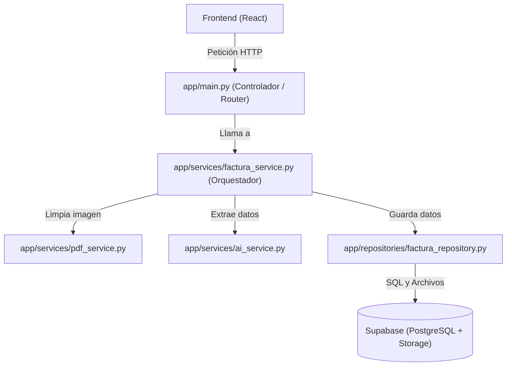

# 📘 Módulo 01: Backend, FastAPI y Arquitectura Limpia

Bienvenido al primer módulo técnico. Aquí aprenderás cómo está estructurado el backend de **FactuSnap** en Python y por qué usamos buenas prácticas de nivel profesional.

---

## 🧩 1. ¿Qué es FastAPI y por qué lo usamos?

**FastAPI** es un framework moderno y de alto rendimiento para construir APIs (servidores web) con Python.
- **Rápido**: Es uno de los frameworks de Python más veloces que existen.
- **Validación automática**: Revisa automáticamente que los datos recibidos sean válidos.
- **Tipado estático**: Aprovecha las anotaciones de tipo de Python para evitar errores antes de ejecutar el código.

---

## 🏛️ 2. Arquitectura Limpia (Clean Architecture)

En proyectos pequeños, la gente suele escribir todo el código en un solo archivo gigante. Eso se vuelve imposible de mantener. En **FactuSnap** dividimos el código en capas:



### Las 4 Capas Clave:
1. **Controlador (`app/main.py`)**: Su único trabajo es recibir la petición del cliente y responder con un código HTTP (200 OK, 201 Created, 400 Bad Request, etc.).
2. **Servicio (`app/services/`)**: Contiene las reglas del negocio (cómo procesar la factura, cómo orquestar la IA, cómo sanitizar la imagen).
3. **Repositorio (`app/repositories/`)**: Es el único responsable de comunicarse con la base de datos o almacenamiento externo (Supabase).
4. **Modelos (`app/models/`)**: Define la estructura de los datos con `Pydantic`.

---

## 🔍 3. El Código Explicado Línea por Línea

### A. Los Modelos (`backend/app/models/factura_model.py`)

```python
from pydantic import BaseModel, Field
from typing import Optional

class FacturaExtraidaData(BaseModel):
    emisor: str = Field(..., description="Nombre o razón social del emisor de la factura")
    nit: Optional[str] = Field(None, description="Número de Identificación Tributaria o RFC/RUT")
    fecha: str = Field(..., description="Fecha de la factura en formato YYYY-MM-DD")
    monto_total: float = Field(..., description="Monto total cobrado en la factura")
    impuestos: float = Field(0.0, description="Monto total de impuestos (IVA, Sales Tax)")
    moneda: str = Field("COP", description="Código de la moneda (ej. COP, USD, EUR)")
    categoria: Optional[str] = Field("General", description="Categoría asignada al gasto")
```

**Conceptos clave:**
- `BaseModel`: Clase base de Pydantic. Si alguien intenta pasar `"mil"` en `monto_total`, Pydantic lanza un error porque espera un `float`.
- `Field(...)`: Los tres puntos `...` significan que ese campo es **obligatorio**.
- `Optional[str]`: Significa que el valor puede ser un `str` (texto) o `None` (nulo).
- `Field(0.0)` o `Field("COP")`: Si el campo no viene en la petición, toma ese valor por defecto.

---

### B. El Enrutador Principal (`backend/app/main.py`)

```python
from fastapi import FastAPI, UploadFile, File, HTTPException
from fastapi.middleware.cors import CORSMiddleware
from app.services.factura_service import FacturaService

app = FastAPI(title="FactuSnap API", version="1.0.0")

# Configuración de CORS
app.add_middleware(
    CORSMiddleware,
    allow_origins=["http://localhost:5173", "http://127.0.0.1:5173"],
    allow_credentials=True,
    allow_methods=["*"],
    allow_headers=["*"],
)

factura_service = FacturaService()

@app.post("/api/facturas/scan", status_code=201)
async def scan_factura(file: UploadFile = File(...)):
    if not file.content_type.startswith("image/"):
        raise HTTPException(status_code=400, detail="El archivo debe ser una imagen válida.")
    
    contents = await file.read()
    resultado = factura_service.procesar_y_guardar_factura(contents)
    return resultado
```

**Conceptos clave:**
- `CORSMiddleware`: Permite que tu frontend (en el puerto `5173`) pueda hacer peticiones al backend (en el puerto `8000`) sin que el navegador bloquee la conexión por seguridad.
- `UploadFile`: Maneja la subida de archivos pesados en memoria o disco de forma eficiente.
- `await file.read()`: Lee los bytes binarios de la imagen de forma asíncrona (no bloquea el servidor).
- `raise HTTPException(status_code=400, detail=...)`: Devuelve una respuesta de error controlada al cliente.

---

### C. El Servicio Orquestador (`backend/app/services/factura_service.py`)

```python
import unicodedata
from app.services.pdf_service import PDFService
from app.services.ai_service import AIService
from app.repositories.factura_repository import FacturaRepository

class FacturaService:
    def __init__(self):
        self.pdf_service = PDFService()
        self.ai_service = AIService()
        self.repository = FacturaRepository()

    def procesar_y_guardar_factura(self, image_bytes: bytes):
        # 1. Sanitizar imagen y generar PDF limpio
        pdf_bytes, pil_image = self.pdf_service.sanitizar_y_convertir_a_pdf(image_bytes)

        # 2. Extraer datos con Gemini
        factura_data = self.ai_service.procesar_imagen_factura(pil_image)

        # 3. Construir nombre seguro sin tildes (ej: Baterias_2026-08-18_1000COP.pdf)
        emisor_sin_tildes = unicodedata.normalize('NFKD', factura_data.emisor).encode('ASCII', 'ignore').decode('utf-8')
        safe_emisor = "".join(c for c in emisor_sin_tildes if c.isalnum() or c in " _-").strip().replace(" ", "_")
        file_name = f"{safe_emisor}_{factura_data.fecha}_{factura_data.monto_total}{factura_data.moneda}.pdf"

        # 4. Guardar archivo en Storage y registro en BD
        pdf_url = self.repository.subir_pdf_storage(pdf_bytes, file_name)
        registro_guardado = self.repository.guardar_factura_db(factura_data, pdf_url)
        
        return registro_guardado
```

---

## 💡 Conceptos Fundamentales a Recordar

1. **Entorno Virtual (`venv`)**: Carpeta aislada donde viven las librerías del proyecto para no interferir con otras versiones de Python en tu sistema.
2. **Servidor ASGI (`Uvicorn`)**: Programa que ejecuta aplicaciones asíncronas de Python (`python -m uvicorn app.main:app --reload --port 8000`). El parámetro `--reload` reinicia el servidor automáticamente cuando detecta cambios en el código.
3. **Inmutabilidad y Separación de Responsabilidades**: Un archivo no debe hacer el trabajo de otro. Si queremos cambiar la base de datos mañana (por ejemplo, pasar de Supabase a MySQL), **solo** modificamos `factura_repository.py`, sin tocar `main.py` ni `factura_service.py`.

---

### ➡️ Siguiente Módulo:
Aprende cómo manipulamos los píxeles de la imagen con matemáticas de matrices:  
👉 [Módulo 02: Matemáticas de Imágenes con Pillow y NumPy](file:///c:/Users/Yaorj/Documents/FactuSnap/docs/02_MATEMATICAS_DE_IMAGENES_NUMPY.md)
